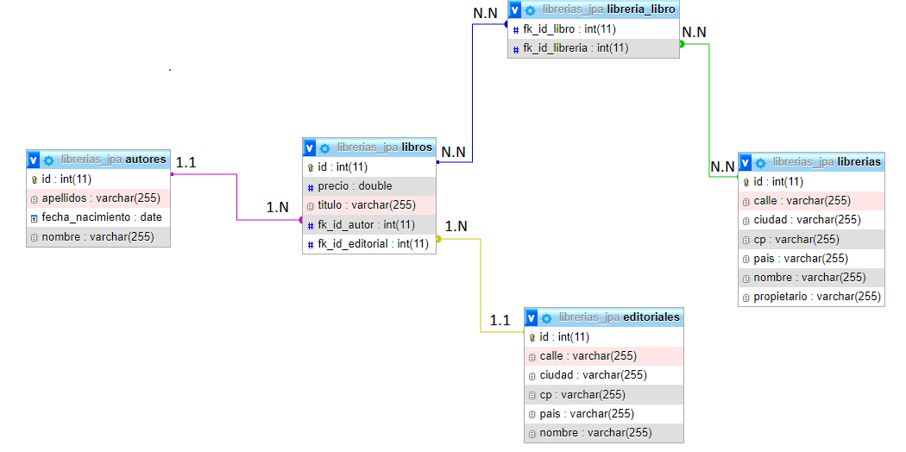

# AD-3 JPA


## Objetivos:

Crear una base de datos usando JPA.

Se pide realizar las siguientes consultas y mostrarlas por pantalla, cada una debe de ser independiente:

1. Mostrar todos los libros dados de alta, con su editorial y su autor
2. Mostrar todos los autores dados de alta, con sus libros asociados
3. Mostrar todas las librerías, con solamente sus libros asociados
4. Mostrar todos los libros dados de alta, y en la librería en la que están.

## Diseño de la base de datos:



## Explicación:

En este apartado, dado que el código tiene los comentarios necesarios para comprender el código, pasaremos a explicar las anotaciones, así nos servirá de repaso.

| Anotación | Definición |
| --- | --- |
| @Entity | Se aplica a la clase e indica que esta clase Java es una entidad a persistir. |
| @Table(name=“Autor”) | Se aplica a la clase e indica el nombre de la tabla de la base de datos donde se persistirá la clase. |
| @Id | Se aplica a un atributo Java e indica que este atributo es la clave primaria. |
| @GeneratedValue(strategy = GenerationType.IDENTITY) | Especifique la estrategia de generación de clave principal. En nuestro caso la clave primaria es generada automáticamente por la base de datos. Tiene que ir acompañada de @id. |
| @Column(name=“Fecha_nacimiento”) | Se aplica a un atributo Java e indica el nombre de la columna de la base de datos en la que se persistirá la propiedad. |
| @Temporal | Se aplica a un atributo Java y sirve principalmente para trabajar con fechas. |
| @OneToOne | Puede establecer asociaciones de uno a uno entre beans de entidad. |
| @OneToMany | Puede establecer asociaciones de uno a muchos entre beans de entidad. |
| @ManyToOne | Puede establecer asociaciones de muchos a uno entre beans de entidad. |
| @ManyToMany | Puede establecer asociaciones de muchos a muchos entre beans de entidad. |
| @JoinColumn | Anota los campos que almacenan la relación entre las tablas y debe marcarse en los atributos de la entidad. Se puede usar no solo con @OneToOne, sino también con las etiquetas @ManyToOne o @ManyToMany. |

Para poder interactuar con la bbdd tendremos que tener un gestor de entidades, el Entity Manager. Para crearle lo haremos de la siguiente forma y aprovechamos para crear también el objeto para hacer transacciones:

```java
 EntityManagerFactory factory = Persistence.createEntityManagerFactory("JPALibrerias");
 EntityManager entityManager = factory.createEntityManager();

 // Para metodos que modifiquen la bbdd
 EntityTransaction entityTransaction = entityManager.getTransaction();
```

Por ejemplo, queremos meter datos en la bbdd por lo cual tendremos que empezar la transacción con `entityTransaction.begin()` y persistiremos, en nuestro caso todos los datos mediante el Autor, `entityManager.persist(autor)` . Lo hacemos efectivo con `entityTransaction.commit()`

```java
public boolean añadir(Autor autor) {
		try {
			System.out.println("Conexion abierta = " + abrirConexion());
			entityTransaction = entityManager.getTransaction();
			entityTransaction.begin();
			entityManager.persist(autor);
			entityTransaction.commit();
			System.out.println("Conexion cerrada = " + cerrarConexion());
			return true;
		} catch (Exception e) {
			System.err.println("ERROR: " + e.getLocalizedMessage());
			System.err.println("Conexion cerrada = " + cerrarConexion());
			return false;
		}
	}
```

Ahora vamos a consultar la bbdd, en este caso no necesitaremos iniciar una transacción. Simplemente con el `entityManager`crearemos una consulta y nos devolverá una lista de resultados. Vamos a utilizar una consulta de hibernate donde la `“a”` hace referencia a que nos devuelva todo.

```java

	public List<Autor> list() {
		try {
			List<Autor> autores = entityManager.createQuery("from Autor a" ).getResultList();
			return autores;
		} catch (Exception e) {
			System.err.println("ERROR: " + e.getLocalizedMessage());
			System.out.println("Conexion cerrada = " + cerrarConexion());
			return null;
		}

	}
```